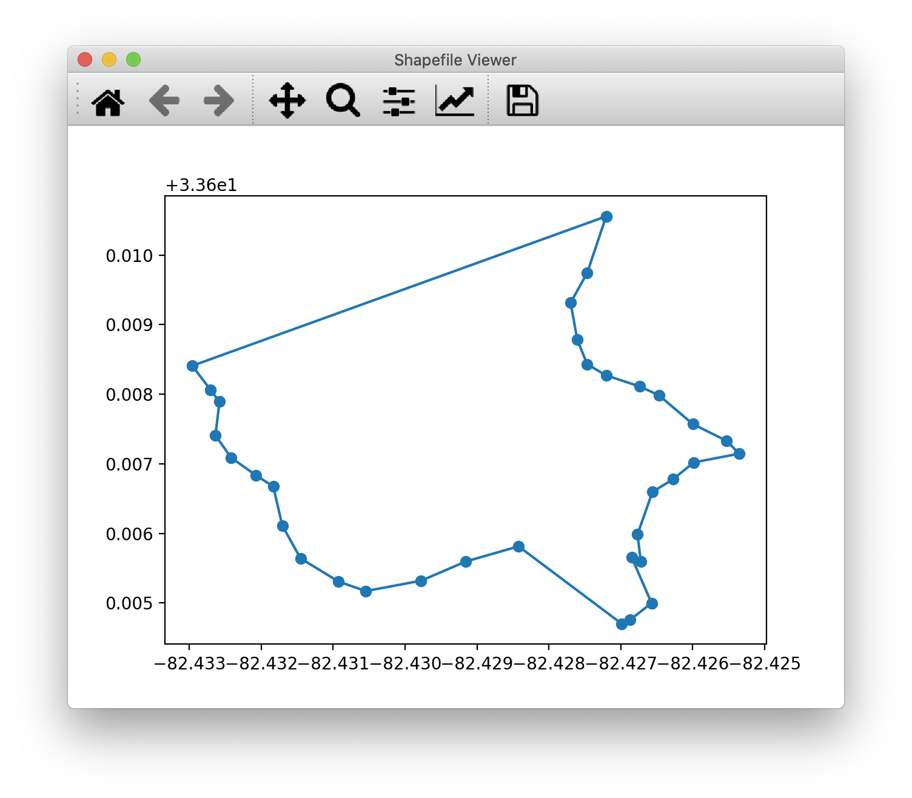

# Shape File Viewer

View shape files in python with gdal and matplotlib.



## Install

Clone and install the requirements for the app.

```
git clone https://github.com/asaladino/shape_file_viewer.git
cd shape_file_viewer
python -m pip install -r requirements.txt
```

## Run

To view a shape file, pass the file location to the path.

```
python ./shape_file_viewer/ --path=/path/to/shape/file.shx
```
